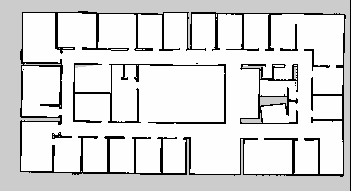

# Homework assignment

In this assignment, you are asked to create a node which, for a given coordinates and a given map, returns whether the given location is occupied (i.e. whether there is an obstacle), free, or unknown. This is needed when a robot wants to avoid obstacles or plan a safe path to a target location.

## Map file
The map you will use for testing is shown below.



This is a 2D occupancy grid map. It represents the environmet as a grid that consists of cells, where each cell corresponds to a location in the physical space. Each cell can have a value of **100** representing occupied space, **0** representing free space, or **-1** representing unknown space. It looks like a floor plan. Before going any further, read [here](occupancy_grid_maps.md) about occupancy grid maps.

- First, place the ```home_work``` folder in your workspce (inside ```catkin_ws/src```), and build it using the ```catkin build``` command.


- The map is saved in the ```map``` folder (```../home_work/map```). ROS comes with a package (```map_server``` package) which can be used to read map files, and publish the map as a ROS message. There is a launch file which runs the ```map_server``` node with the given map file.

```
roslaunch home_work map.launch
```

- If you list the topics, you can find the ```/map``` topic.
- Check the message type of this topic. 
- You'll find that its type is: [OccupancyGrid](http://docs.ros.org/kinetic/api/nav_msgs/html/msg/OccupancyGrid.html). Read more about it and what fields it has.
- Note that the message has a field name ```data```, which is an array of integers (in python it is a list of integers). 

## Rviz

- To visualize the map, you can use Rviz. Rviz is a program that comes with ROS.
- It can subscribe to a topic and visualize the messages being published on it.
- It supports popular ROS messages like images, laser scans, point clouds, occupancy grid maps, and more.

- To run Rviz:
```
rosrun rviz rviz
```

# Task

- Create a node that subscribes to two topics:
    - a topic of type ```OccupancyGrid``` for receiving the map.
    - a topic of type ```geometry_msgs/PointStamped``` intended for recieving the location at which the node has to check for the occupancy value.
- Define a custom message with the following fields:
    - **value** (type ```int```):&nbsp;&nbsp; the occupancy value (-1, 100, or 0).
    - **x** (type ```float```):&nbsp;&nbsp; coordinate of the point.
    - **y** (type ```float```):&nbsp;&nbsp; y coordinate of the point.
    - **result** (type ```string```):&nbsp;&nbsp; "unknown", "occupied", or "free".
- The node should publish the result as a message of the type you created.
  
- Create a launch file to start (i) your node, (ii) the ```map_server``` node, and (iii) the Rviz node. Make your node customizable using ROS paramters and define these parameters in your launch file.

:bulb: You can publish the point from Rviz using this &nbsp; &nbsp;    &nbsp; &nbsp;  button. 

- When you use Rviz to publish a point, make sure Rviz uses the same coordiante frame as the map (i.e. the Rviz fixed frame is set to  ```map```):
  
